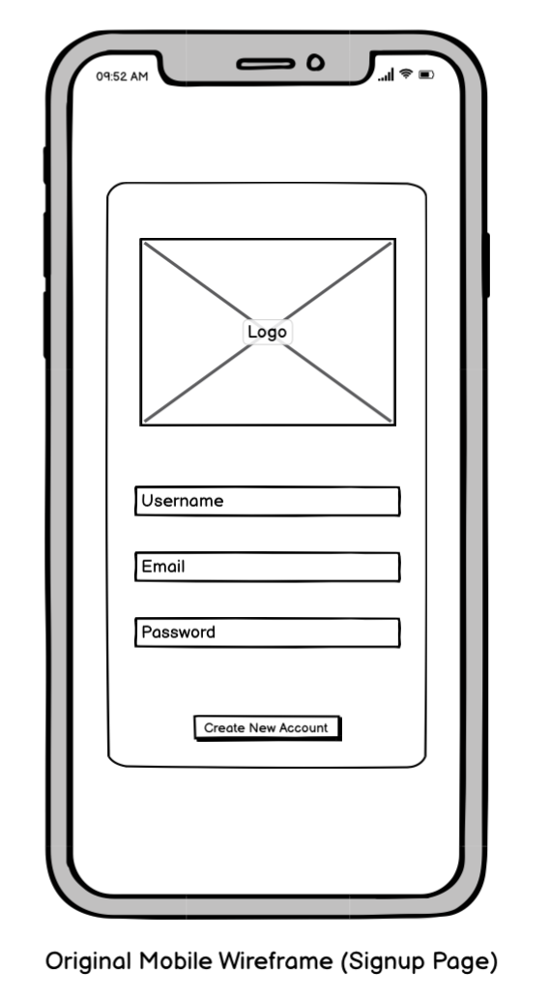
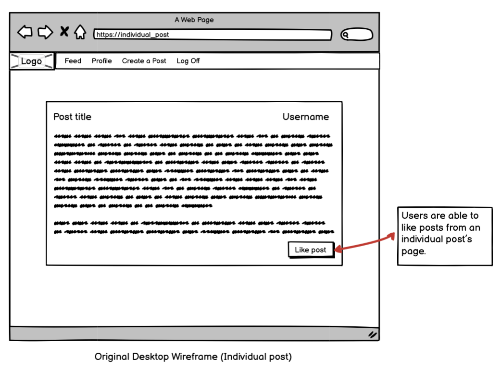
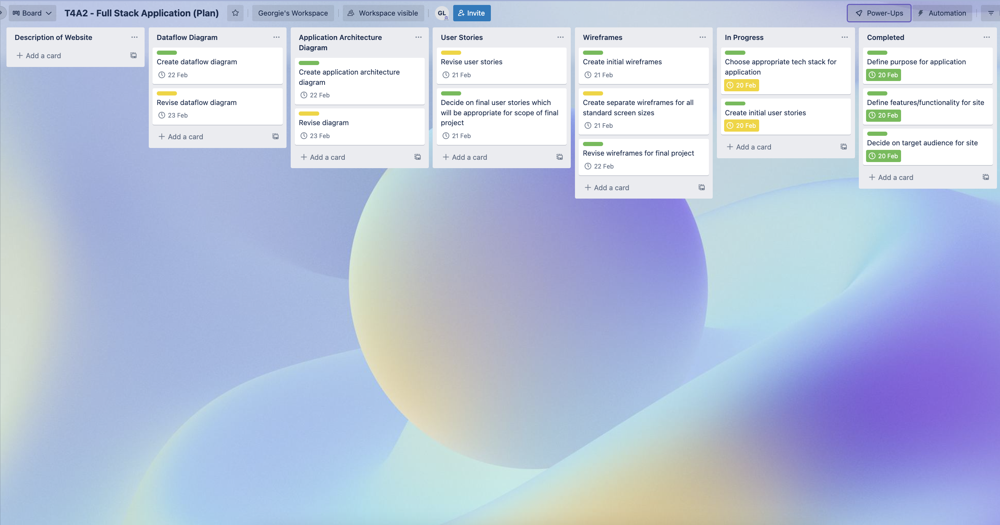
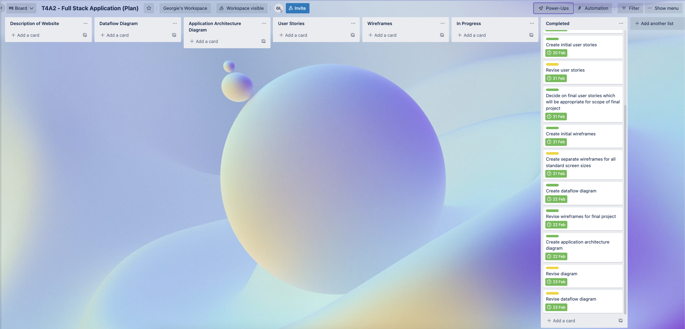

# 
 *WhereTo?* 

Link to live site:

Link to Github repo: https://github.com/GeorgieLiefman/WhereTo_project

# 
Purpose of Application

*WhereTo?* is an application that allows for its users to share their travel stories and reviews of places around the world they have visited with an online community. Not only does *WhereTo?* provide a sense of community for users, it also provides real consumer evaluations of accommodations, dining experiences, and tourism activities so that travelers may feel confident about their vacation plans before they commit.
 

# 
 Functionality and Features of *WhereTo?*

- The application allows users to post reviews/stories about their previous travel experiences.
- User posts consist of a title, description, destination, price and category of the subject of their review (for example restaurant, hotel or activity).
- Authors of posts are able to delete their posts if they wish too.
- Users are able to sign up to the site and user authentication is used where appropriate.
- Users can comment and delete comments on a post.
- Users are able to heart and unheart reviews.
- The application is built through using AWS cloud services including: EC2 and Route 53.

# 
 Significant Libraries and Technologies

- Flask: The web framework was used to help build the application. Flask's variety of tools, libraries and technologies aided in the application's construction. Notably, Flask has been used to handle authentication throughout the program.
- Jinja: Jinja is a web template engine for the Python programming language. Jinja has been used in the program to create HTML templates for the Python scripts.
- Bootstrap: Bootstrap is a front-end framework used to create modern websites and web apps. The framework has been used in the application to alter the aesthetic of the site and to make the application fully responsive.
- Gunicorn: Gunicorn is a Python Web Server Gateway Interface HTTP server. The technology in combination with Nginx was used to deploy the application.
- Nginx: Nginx is a web server that can also be used as a reverse proxy, load balancer, mail proxy and HTTP cache. The technology in combination with Gunicorn was used to deploy the application.
- PostgreSQL: PostgreSQL is a free and open-source relational database management system (RDBMS) emphasizing extensibility and SQL compliance. The tool is used in the application to store/retrieve data relating to the user, review, comment and heart models.
- EC2: EC2 instances provide scalable computing capacity in the AWS Cloud.In the application EC2 instances are used for running code on persistent infrastructure. EC2 has been used to run the flask application.
- Route 53: Amazon Route 53 is a scalable and highly available Domain Name System service. Technology has been utilised to create a custom domain name for the site.

# 
 Deployment

*WhereTo?* has been deployed to AWS. The application has used a number of technologies in its deployment including: EC2, Route 53, Gunicorn and Nginx. Multiple environment variables were configured in the deployment of the site and screenshots of these configurations are attached below.

###  
**Configuration of Security Group for Database** ###

###  
**Configuration of Security Group for Application** ###

###  
**Configuration of EC2 for Database** ###

###  
**Configuration of EC2 for Application** ###

# 
 Appropriate use of Project Management Methodology

I chose to use an Agile project management methodology to ensure that I worked efficiently and productively whilst still delivering high quality work. I used a Trello board throughout the project which allowed me to track tasks, label each task with a difficult level, checklists and due dates. Additionally, the use of the Trello board allowed me to prioritise tasks so I could make sure all the features which matter most to users were included and functional before I attempted to add in extra features. A number of screenshots of the Trello board used throughout the project are attached below.

###  
**Trello Screenshots** ###

# 
 Appropriate use of Task Delegation Methodology

As the sole developer of *WhereTo?* all tasks for the project have been delegated to myself. Consequently, this has made completing the application quite challenging as while I am strong with Python, Flask and building a simple user interface I am new to using cloud and serverless technologies and deploying an application on a Cloud service. While ordinarily developers would be able to rely on their team members in their areas of weaknesses, I have had to use online resources and turn to my tutors in order to make up for my shortcomings and complete the project.

# 
 Testing during Development

Unittesting and a manual testing suite were used to test all features of the site during development. A screenshot of the Excel file of a manual test suite used for testing during development is attached below.

###  
**Manual Testing Suite (Development)** ###

# 
 Testing during Production

A screenshot of the Excel file of a manual test suite used for testing during production is attached below. Images of a client using/testing the site are also included below.

###  
**Manual Testing Suite (Production)** ###

###  
**Client Creating a Review** ###

###  
**Client Testing Homepage** ###

###  
**Client causing Error Message due to Entering Incorrect Password** ###

###  
**Client Testing Site on Alternate Computer** ###

#   
 Real World App - Part A (README.md) 

# 
 *WhereTo?* 

# 
Description of Website

 
### 
**Purpose of Application** ###
*WhereTo?* is an application that allows for its users to share their travel stories and reviews of places around the world they have visited with an online community. Not only does *WhereTo?* provide a sense of community for users, it also provides real consumer evaluations of accommodations, dining experiences, and tourism activities so that travelers may feel confident about their vacation plans before they commit.
 
###  
**Functionality and Features of *WhereTo?*** ###
- The application allows users to post reviews/stories about their previous travel experiences.
- User posts consist of a title, description, destination, category of the subject of their review (for example restaurant, hotel or activity) and a rating out of five stars.
- Authors of posts are able to delete their posts if they wish too.
- Users are able to search up posts by keywords, read all reviews on the site and like any posts which they've found to be helpful.
- Users are able to sign up to the site and user authentication is used where appropriate.
- The application makes use of the SkyScanner API so users are able to search up flight costs if they desire or feel inspired by other users' reviews.
- The application is built through using AWS cloud services including: EC2 (both instances and load balancers), Lambda, Amazon RDS and the API Gateway.
- The application utilities DevOps technologies including: version control (git/Github and webhooks) and Docker.
 
###  
**Target Audience** ###
Given the nature of the application, *WhereTo?*'s target audience is broadly all travel lovers. *WhereTo?*'s target demographic is travel aficionados who, rather than using traditional travel agencies, turn to the internet for assistance with travel services and an eagerness to hear about other traveler's adventures.
 
###  
**Tech Stack** ###
- Languages: Python, HTML5/CSS3
- Frameworks: Flask, Bootstrap
- Databases: Amazon RDS
- Other: Docker, AWS (Lambda, EC2, API gateway), Git/Github (Webhooks)

# 
 Dataflow Diagram

### 
**New User Singup Dataflow Diagram** ### 

###  
**Edit Profile Information Dataflow Diagram** ### 

###  
**Like a Post Dataflow Diagram** ### 

###  
**Create a Post Dataflow Diagram** ### 

###  
**Search for a Post Dataflow Diagram** ### 

###  
**Delete Post Dataflow Diagram** ### 

# 
 Application Architecture Diagram

 

1) Client: Represents the client whose first point of interaction with the application is the API Gateway.
 2) AWS Cloud: The application is deployed on AWS Cloud services.
 3) AWS API Gateway: The gateway is an API management system which lies in the intermediate of a user and a set of backend services. Essentially the tool’s role in the application's architecture is to direct requests to the correct recipient.
 4) AWS Load Balancer: Inbound application traffic is distributed over multiple EC2 instances, across several Availability Zones via the load balancer.
 5) AWS EC2: In the application EC2 instances are used for running code on persistent infrastructure. EC2 has been used to run the flask application.
 6) Flask: Flask is a Python framework which has been used for creating a dependable, scalable, and maintainable online application.
 7) Python: The application is written in Python, which is a general purpose programming language.
 8) HTML5: HTML5 is a markup language which is used to create the basic layout and foundation of the web application that the user interacts with.
 9) Bootstrap: Bootstrap is a front-end framework which has been used to alter the aesthetic of the UI of the site.
 10) Docker: Docker's features and ability for containerising programs that enable development and rapid release make it ideal for the DevOps pipeline. The tool is important to the app since it ensures that any functionality that works in the development platform will also work in the production and staging environments.
 11) AWS Cognito: The application makes advantage of Amazon Cognito to make user sign-up and authentication simple.
 12) AWS Lambda: Lambda functions are used to run code on non-persistent infrastructure.
 13) AWS RDS: The service makes it simple to establish, run, and expand a database system in the cloud. A PostgreSQL engine type has been selected for the application. The tool is used in the application to store data in both the form of a user and post database table.

# 
 User Stories

### 
**Original User Stories** ###
- As an avid traveler I want to review my previous experiences and share my travel stories, so I can help inform other travelers.
- As a holiday planner I want to read other users' travel reviews, so that I can plan my next holiday informed by real travelers' reviews.
- As a member of the travel community I want to be able to read and like the reviews from other users, so I can engage with other travelers and their posts.
- As a new user I want to be able to create an account, so I can have access to features only available to *WhereTo?* users.
- As a user I want to be able to reset my password, so I am able to recover my account in case I forget my login credentials.
 
###  
**Revised User Stories** ###
In order to better define the scope of the project and create more meaningful and helpful features for users, the user stories have been revised.
 
- As an avid traveler I want to thoroughly review and rate my previous experiences, so I can help inform other travelers.
- As an avid traveler I want to post about my previous travel stories, so I am able to come back and reflect on my journeys.
- As a user of *WhereTo?* that posts reviews, I want to be able to alter my old posts, so I can delete or edit posts in case my opinions change overtime.
- As a holiday planner I want to read other users' travel reviews, so that I can plan my next holiday informed by real travelers' reviews.
- As a holiday planner I want to have access to flight information, so I scan flight costs to destinations that have been mentioned in other travelers' posts.
- As a holiday planner I want to be able to filter through posts by keywords, so I can quickly find information I am looking for in regards to a destination or activity.
- As a member of the travel community I want to be able to read and like the reviews from other users, so I can engage with other travelers and their posts.
- As a member of the travel community I want posts and reviews to be categorised, so I am able to quickly find what I am looking for and not have to read through whole posts I am not interested in.
- As a new user I want to be able to create an account, so I can have access to features only available to WhereTo? users.
- As a user I want to be able to reset my password, so I am able to recover my account in case I forget my login credentials.

# 
 Wireframes

### 
**Original Login Page Wireframes** ### 

###  
**Revised Login Page Wireframes** ### 

###  
**Original Signup Page Wireframes** ### 

###  
**Revised Signup Page Wireframes** ### 

###  
**Original Feed Page Wireframes** ### 

###  
**Revised Feed Page Wireframes** ### 

###  
**Original Submit Post Page Wireframes** ### 

###  
**Revised Submit Post Page Wireframes** ### 

###  
**Original User Profile Page Wireframes** ### 

###  
**Revised User Profile Page Wireframes** ### 

###  
**Original Individual Post Page Wireframes** ### 

###  
**Revised Individual Post Page Wireframes** ### 

# 
 Trello Board Screenshots

The images attached below depict screenshots of the Trello board for the planning stage of the application throughout the duration of the project. A screenshot of the Trello board for the actual project has also been attached but as the project is not yet completed only an intial screenshot of the board is included.

###  
**Trello Board for Planning of the Application** ### 

###  
**Trello Board for Actual Project** ### 
